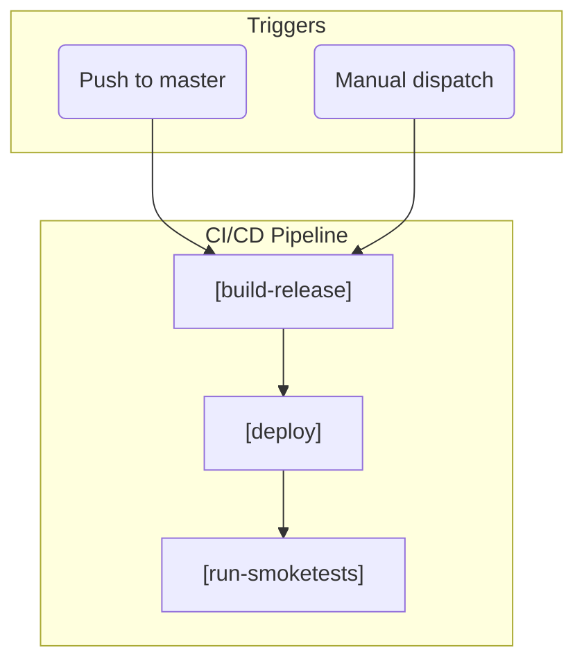
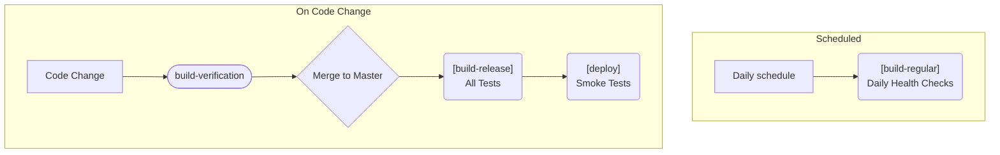

# CI/CD Pipeline

CI/CD pipeline ensures code quality, security, and reliable deployments through automated workflows.

## Core Workflows

### [build-and-test](../.github/workflows/build-and-test.yml)
**Purpose**: Reusable workflow foundation used across all verification processes.

**Key Features:**

- SonarCloud static code analysis
- Complete solution build
- Comprehensive test execution (excludes smoke tests)
- Test results publication

### [build-verification](../.github/workflows/build-verification.yml)
**Purpose**: Pull request validation ensuring code quality before merge.

**Triggers**: Pull request creation/updates
**Process**: Leverages [build-and-test](#build-and-test) for comprehensive verification
**Focus**: Code quality, test coverage, and integration validation

### [build-release](../.github/workflows/build-release.yml)
**Purpose**: Production deployment pipeline triggered on master branch changes.

**Triggers**: Push to `master` branch
**Process**:

**Integration**:

### [build-regular](../.github/workflows/build-regular.yml)

- **Purpose**: Scheduled health checks and continuous quality monitoring.
- **Triggers**: Regular schedule (daily)
- **Process**: Uses [build-and-test](#build-and-test) for routine verification
- **Benefits**: Early detection of environmental issues and dependency problems

## Deployment & Testing

### [deploy](../.github/workflows/deploy.yml)
**Purpose**: Azure deployment with integrated smoke testing.

**Responsibilities:**
- 🌐 Azure infrastructure deployment
- 🧪 Post-deployment smoke test execution
- 🔗 Environment validation

**Integration**: Called by [build-release](#build-release), triggers [run-smoketests](#run-smoketests)

#### [run-smoketests](../.github/workflows/run-smoketests.yml)
**Purpose**: End-to-end validation of deployed application functionality.

**Features:**
- 🎯 Critical path testing
- 🌐 Production environment validation
- 📊 Deployment health verification

**Usage**: 
- Automated: Called by [deploy](#deploy) workflow
- Manual: Regular scheduled runs for ongoing monitoring

## Security & Quality

### [codeql](../.github/workflows/codeql.yml)
**Purpose**: GitHub's semantic code analysis for security vulnerability detection.

## Test Execution Flow

