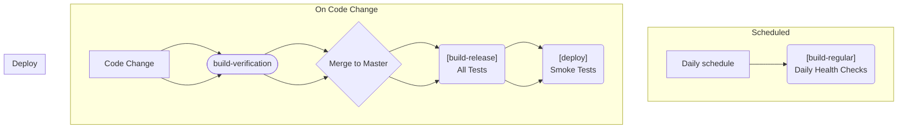

# CI/CD Pipeline

Our CI/CD pipeline automates code integration and deployment, focusing on quality, security, and reliability. This
document outlines the core workflows that make it all happen.

## Core Workflows

### `build-and-test`

**Purpose**: This is the foundational workflow for all our verification processes. It's a reusable workflow that ensures
consistency.

**Key Features**:

- **Static Code Analysis**: Runs SonarCloud to catch bugs and vulnerabilities early.
- **Solution Build**: Compiles the entire solution to ensure all parts work together.
- **Comprehensive Testing**: Executes a full suite of tests (excluding smoke tests).
- **Test Publication**: Publishes test results for review.

### `build-verification`

**Purpose**: Guards our codebase by validating all pull requests before they are merged.

- **Triggers**: Activates on pull request creation or updates.
- **Process**: Leverages the `build-and-test` workflow for a thorough check.
- **Focus**: Ensures code quality, maintains test coverage, and validates integration.

### `build-release`

**Purpose**: Handles the deployment to production when changes are pushed to the `master` branch.

- **Triggers**: Activates on a push to the `master` branch.
- **Process**:
  ```mermaid
  flowchart TD
      subgraph "Triggers"
          Merge(Push to master)
          Dispatch(Manual dispatch)
      end

      subgraph "CI/CD Pipeline"
          direction LR
          BuildRelease["[build-release]"]
          Deploy["[deploy]"]
          SmokeTests["[run-smoketests]"]
      end

      Merge --> BuildRelease
      Dispatch --> BuildRelease
      BuildRelease --> Deploy
      Deploy --> SmokeTests
  ```

### `build-regular`

- **Purpose**: Performs scheduled health checks to monitor the application's stability over time.
- **Triggers**: Runs on a daily schedule.
- **Process**: Uses the `build-and-test` workflow for routine verification.
- **Benefits**: Helps in early detection of environmental issues or problems with dependencies.

## Deployment & Testing

### 🚢 `deploy`

**Purpose**: Manages the deployment to Azure and kicks off initial smoke tests.

**Responsibilities**:

- **Infrastructure Deployment**: Deploys the necessary Azure infrastructure.
- **Smoke Test Execution**: Runs post-deployment smoke tests to ensure basic functionality.
- **Environment Validation**: Validates the deployed environment.

**Integration**: Called by `build-release` and triggers `run-smoketests`.

#### 🧪 `run-smoketests`

**Purpose**: Conducts end-to-end tests to validate the deployed application's core functionality.

**Features**:

- **Critical Path Testing**: Focuses on the most critical application paths.
- **Production Validation**: Validates the application in a production-like environment.
- **Health Verification**: Provides a clear signal on the health of the deployment.

**Usage**:

- **Automated**: Triggered by the `deploy` workflow.
- **Manual**: Can be run manually for ongoing monitoring.

## Security & Quality

### 🛡️ `codeql`

**Purpose**: Uses GitHub's semantic code analysis to detect security vulnerabilities.

## Test Execution Flow

This diagram illustrates how different types of tests are executed based on the trigger.

